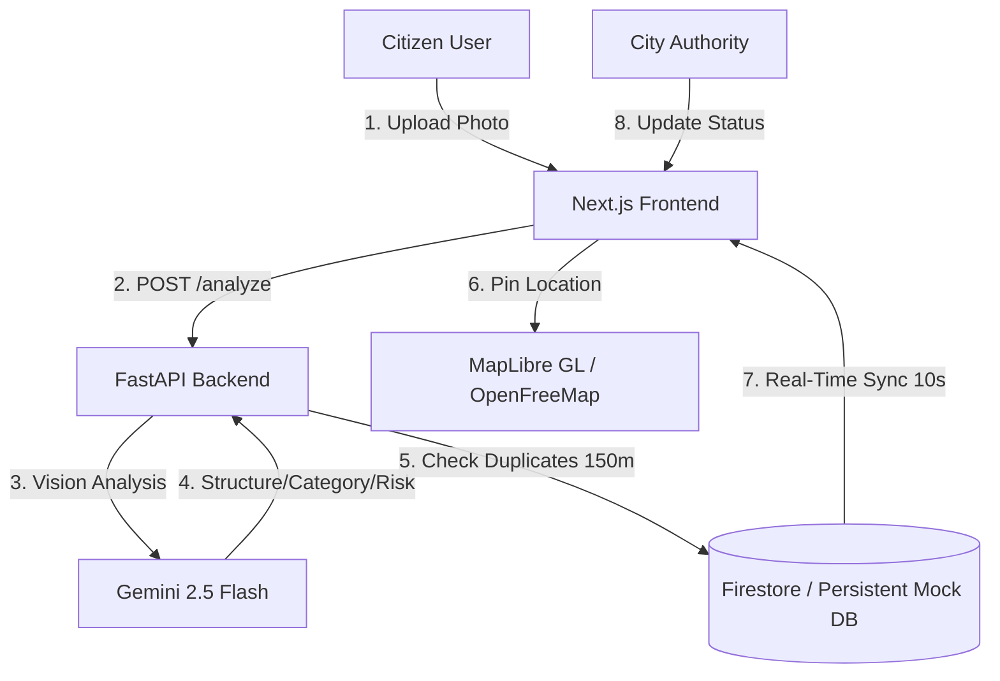

# 👁️ CivicEye AI

An AI-powered, hyperlocal civic issue reporting and verification platform. CivicEye AI empowers citizens to capture street-level issues (like potholes, road hazards, broken lights, and water leaks) and uses **Gemini 2.5 Flash** to automatically classify, localize, and score the issues. 

Local authorities gain a priority-sorted work queue to track, assign, and resolve issues, while citizens earn badges and improve their trust scores through verified contributions.

---

## 🚀 Key Features

* **AI-Powered Photo Analysis**: Citizens capture or upload a photo, and **Gemini 2.5 Flash** instantly analyzes the image to determine the category, specific issue type, severity level, potential risks, and the correct municipal department.
* **Real-Time Interactive Maps**: Powered by **MapLibre GL JS** and **OpenFreeMap** (completely free, no API keys required). Features automated 10-second polling for live feed updates, GPS user centering, and auto-fitting bounds to show active issues.
* **Smart Priority Scoring**: Issues are scored (0-100) based on severity, age of report, citizen verifications, and regional weight factors to surface critical safety hazards instantly.
* **Duplicate Report Detection**: Compares new reports against nearby reports (within 150 meters) using text embeddings to prevent duplicate work queues.
* **Persistent Mock DB Fallback**: Supports seamless local developer testing by falling back to a persistent JSON-file mock database (`~/.gemini/antigravity/civiceye_mock_db.json`) if Cloud Firestore is not configured or offline.
* **Gamification & Trust Scores**: Citizen ranks are updated in real-time on a community leaderboard based on reports, verifications, and trust scores.

---

## ⚙️ Tech Stack

| Layer | Technologies |
| :--- | :--- |
| **Frontend** | React 18, Next.js 16 (App Router), TypeScript, Tailwind CSS |
| **Backend** | FastAPI (Python 3.11+), Pydantic, Uvicorn |
| **Mapping Engine** | MapLibre GL JS + OpenFreeMap Liberty Style (Free Tile Delivery) |
| **Geocoding** | Nominatim OpenStreetMap API (Free, no-key lookup) |
| **AI Processing** | Google Gemini 2.5 Flash API (Vision & Text Embeddings) |
| **Auth & Storage** | Firebase Authentication, Cloud Firestore, Firebase Storage |

---

## 🏗️ System Architecture



---

## 📂 Project Directory Structure

```
CivicEye-AI/
├── frontend/                  # Next.js Web Application
│   ├── app/                   # App Router pages (report, map, dashboard, auth)
│   ├── components/            # Reusable UI parts (landing hero, issue details, map view)
│   ├── lib/                   # Firebase Client, Auth Context, Geolocation helpers
│   ├── public/                # Static assets (drone video, poster images)
│   └── tailwind.config.ts     # Styling parameters
│
└── backend/                   # FastAPI REST Backend
    ├── db/                    # Firebase Admin Client + Mock DB fallback engine
    ├── models/                # Pydantic schemas and database models
    ├── routers/               # API Router endpoints (issues, AI, gamification, priority)
    ├── services/              # AI (Gemini), Geolocation, and Priority Scoring services
    └── main.py                # Backend entry point
```

---

## 🛠️ Local Development Setup

### 1. Backend Setup

```bash
cd backend
# Create and activate python virtual environment
python -m venv .venv
source .venv/bin/activate  # On Windows use: .venv\Scripts\activate

# Install dependencies
pip install -r requirements.txt

# Start local server
uvicorn main:app --reload --port 8000
```
The FastAPI documentation will be available at [http://localhost:8000/docs](http://localhost:8000/docs).

### 2. Frontend Setup

```bash
cd frontend
# Install packages
npm install

# Start local development server
npm run dev
```
Open [http://localhost:3001](http://localhost:3001) in your browser to view the application.

---

## 🔑 Environment Variables

### Frontend Config (`frontend/.env.local` — see `frontend/.env.example` for details)
Configure the frontend to connect to the backend server and your Firebase project:
```env
NEXT_PUBLIC_FIREBASE_API_KEY=YOUR_FIREBASE_API_KEY
NEXT_PUBLIC_FIREBASE_AUTH_DOMAIN=YOUR_PROJECT_ID.firebaseapp.com
NEXT_PUBLIC_FIREBASE_PROJECT_ID=YOUR_PROJECT_ID
NEXT_PUBLIC_FIREBASE_STORAGE_BUCKET=YOUR_PROJECT_ID.firebasestorage.app
NEXT_PUBLIC_FIREBASE_MESSAGING_SENDER_ID=YOUR_MESSAGING_SENDER_ID
NEXT_PUBLIC_FIREBASE_APP_ID=YOUR_APP_ID
NEXT_PUBLIC_API_BASE_URL=http://localhost:8000
```

### Backend Config (`backend/.env`)
Configure the backend with your Gemini API key for visual classifications:
```env
FIREBASE_SERVICE_ACCOUNT_JSON=path/to/serviceAccountKey.json
GEMINI_API_KEY=YOUR_GEMINI_API_KEY
```

> [!NOTE]
> If `FIREBASE_SERVICE_ACCOUNT_JSON` is left empty or not found, the backend automatically switches to its local **Persistent Mock DB** mode (`civiceye_mock_db.json`), requiring zero cloud setup to run locally!

---

## ⚙️ Core Logic Formulas

### Priority Score (0–100)
Calculated using the following normalized weight distributions:
$$Score = (Severity \times 35\%) + (VerificationCount \times 25\%) + (Age \times 20\%) + (PopulationDensity \times 20\%)$$

* **Severity Weights**: High = 100, Medium = 60, Low = 30.
* **Age Factor**: Higher priority given to older unresolved issues.

---

## 🤝 Gamification Levels

Citizens earn badges and advance levels through active community participation:

| Badge | Criteria |
| :--- | :--- |
| **Community Reporter** | Awarded automatically on the 1st submitted issue report. |
| **Civic Contributor** | Awarded at 5+ successful reports or verifications. |
| **Community Hero** | Awarded at 25+ contributions with a $\geq 70\%$ trust score. |
| **City Guardian** | Awarded to users in the top 1% of the community leaderboard. |
